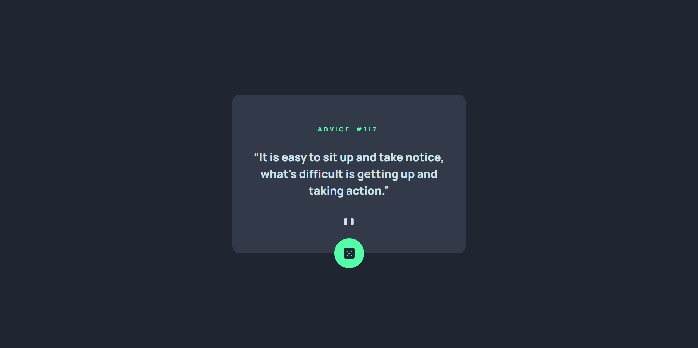

# Frontend Mentor - Advice generator app solution

This is a solution to the [Advice generator app challenge on Frontend Mentor](https://www.frontendmentor.io/challenges/advice-generator-app-QdUG-13db). Frontend Mentor challenges help you improve your coding skills by building realistic projects.

## Table of contents

- [Overview](#overview)
  - [The challenge](#the-challenge)
  - [Screenshot](#screenshot)
  - [Links](#links)
- [My process](#my-process)
  - [Built with](#built-with)
  - [What I learned](#what-i-learned)
  - [Continued development](#continued-development)
  - [Useful resources](#useful-resources)
- [Author](#author)
- [Acknowledgments](#acknowledgments)

## Overview

### The challenge

Users should be able to:

- View the optimal layout for the app depending on their device's screen size
- See hover states for all interactive elements on the page
- Generate a new piece of advice by clicking the dice icon

### Screenshot



### Links

- Solution URL: [https://github.com/victor247k/AdviceGenerator]
- Live Site URL: [https://victor247k.github.io/AdviceGenerator/]

## My process

### Built with

- Semantic HTML5 markup
- CSS custom properties
- Flexbox
- Mobile-first workflow
- JS
- axios

### What I learned

I have learned about the defer atribute in html, about open-quote, close-quote in css and how to use APIs and axios.

```html
<script src="https://unpkg.com/axios/dist/axios.min.js"></script>
<script src="app.js" defer></script>
```
```css
.text::before {
  content: open-quote;
}
.text::after {
  content: close-quote;
}
```
```js
axios.get('https://api.adviceslip.com/advice').then(response => console.log(response.data.slip.advice));
```

### Continued development

I want to practice using APIs more, get better at js and css and to continue to learn.

### Useful resources

- [Axios tutorial](https://youtu.be/qM4G1Ai2ZpE) - This helped me for setup axios and how to use it. I really like how this person explains this stuff.

## Author

- Frontend Mentor - [@yourusername](https://www.frontendmentor.io/profile/victor247k)
- Instagram - [@victorspinei247](https://www.instagram.com/victorspinei247/)
- Bio Link - [dose.lol/victor](https://dose.lol/victor)

## Acknowledgments

I am thankful for this challenge, finally learned what is an API and how to use them.
